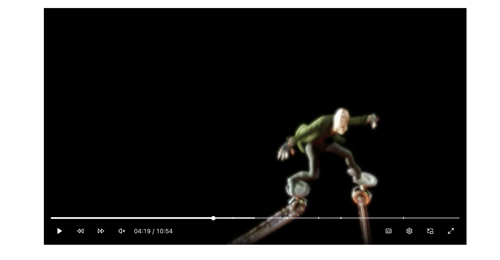

<p align="center">
<a href="https://www.npmjs.com/package/reactjs-player-media" target="_blank" rel="noopener noreferrer">
</a>
</p>

<p align="center">
 A modern media player based on tiptap and shadcn ui for React
</p>

<p align="center">
  <a href="https://www.npmjs.com/package/reactjs-player-media" target="_blank" rel="noopener noreferrer"></a>
  <a href="https://www.npmjs.com/package/reactjs-player-media" target="_blank" rel="noopener noreferrer"></a>
  <a href="https://bundlephobia.com/result?p=reactjs-player-media" target="_blank" rel="noopener noreferrer"></a>
  <a href="https://github.com/hunghg255/reactjs-player-media/graphs/contributors" target="_blank" rel="noopener noreferrer"></a>
  <a href="https://github.com/hunghg255/reactjs-player-media/blob/main/LICENSE" target="_blank" rel="noopener noreferrer"></a>
  <a href="https://webuild.community" target="_blank" rel="noopener noreferrer"></a>
  <a href="https://webuild.community" target="_blank" rel="noopener noreferrer"></a>
</p>



## Demo

[Demo](https://reactjs-player-media-playground.vercel.app/)

## Run Locally

Clone the project

```bash
git clone https://github.com/hunghg255/reactjs-player-media.git
```

Go to the project directory

```bash
cd reactjs-player-media
```

Install dependencies

```bash
pnpm install
```

Start the Demo server

```bash
npm run build:lib:dev
npm run playground
```

## API Reference

### Root

The main container component for the media player.


| Prop Name                | Type                                                                 | Description |
|--------------------------|----------------------------------------------------------------------|-------------|
| onPlay                   | () => void                                                           | Callback when media starts playing |
| onPause                  | () => void                                                           | Callback when media is paused |
| onEnded                  | () => void                                                           | Callback when playback ends |
| onTimeUpdate             | (time: number) => void                                               | Callback when playback time updates |
| onVolumeChange           | (volume: number) => void                                             | Callback when volume changes |
| onMuted                  | (muted: boolean) => void                                             | Callback when muted state changes |
| onMediaError             | (error: MediaError \| null) => void                                  | Callback when a media error occurs |
| onPipError               | (error: unknown, state: "enter" \| "exit") => void                   | Callback when PiP error occurs |
| onFullscreenChange       | (fullscreen: boolean) => void                                        | Callback when fullscreen state changes |
| dir                      | "ltr" \| "rtl"                                                       | Text direction |
| label                    | string                                                               | Accessibility label (default: "Media player") |
| tooltipSideOffset        | number                                                               | Tooltip offset (default: 10) |
| tooltipDelayDuration     | number                                                               | Tooltip delay (default: 600) |
| autoHide                 | boolean                                                              | Enable auto-hiding controls (default: false) |
| disabled                 | boolean                                                              | Disable controls (default: false) |
| withoutTooltip           | boolean                                                              | Disable tooltips (default: false) |

---

#### Data Attributes

| Attribute                | Description                                      |
|--------------------------|--------------------------------------------------|
| `[data-controls-visible]`| Present when the controls are visible.           |
| `[data-disabled]`        | Present when the media player is disabled.       |
| `[data-state]`           | `fullscreen`, `windowed`                         |

### Video

The video element, integrated with the player state.


### Audio

The audio element, integrated with the player state.


### Controls

A container for the media player controls.


#### Data Attributes

| Attribute         | Description                                 |
|-------------------|---------------------------------------------|
| `[data-disabled]` | Present when the controls are disabled.     |
| `[data-state]`    | `fullscreen`, `windowed`                    |
| `[data-visible]`  | Present when the controls are visible.      |

### ControlsOverlay

Displays as a subtle backdrop that improves readability for media controls.


#### Data Attributes

| Attribute        | Description                                 |
|------------------|---------------------------------------------|
| `[data-state]`   | `fullscreen`, `windowed`                    |
| `[data-visible]` | Present when the controls are visible.      |

### Loading

A loading indicator that appears when media is loading, similar to YouTube/Netflix style.

| Prop Name | Type   | Description |
|-----------|--------|-------------|
| delay     | number | Delay before showing loading indicator (default: 500) |

---

### Error

An error component that displays when media playback encounters an error, with retry and reload options.

| Prop Name   | Type                       | Description |
|-------------|----------------------------|-------------|
| error       | MediaError \| null         | Media error object |
| label       | string                     | Error label |
| description | string                     | Error description |
| onRetry     | () => void                 | Callback on retry |
| onReload    | () => void                 | Callback on reload |

---

#### Data Attributes

| Attribute      | Description                      |
|----------------|----------------------------------|
| `[data-state]` | `fullscreen`, `windowed`         |

### VolumeIndicator

A volume indicator that appears when the volume is changed with keyboard interactions.


### Play

A button to play or pause the media.


#### Data Attributes

| Attribute         | Description                                 |
|-------------------|---------------------------------------------|
| `[data-disabled]` | Present when the button is disabled.        |
| `[data-state]`    | `on`, `off`                                 |

### SeekBackward

A button to seek backward in the media.

| Prop Name | Type   | Description |
|-----------|--------|-------------|
| seconds   | number | Seconds to seek backward (default: 5) |

---

#### Data Attributes

| Attribute         | Description                                 |
|-------------------|---------------------------------------------|
| `[data-disabled]` | Present when the button is disabled.        |

### SeekForward

A button to seek forward in the media.

| Prop Name | Type   | Description |
|-----------|--------|-------------|
| seconds   | number | Seconds to seek forward (default: 10) |

---


#### Data Attributes

| Attribute         | Description                                 |
|-------------------|---------------------------------------------|
| `[data-disabled]` | Present when the button is disabled.        |

### Seek

A slider component to seek through the media playback.

| Prop Name                | Type                                                                 | Description |
|--------------------------|----------------------------------------------------------------------|-------------|
| withTime                 | boolean                                                              | Show current/remaining time (default: false) |
| withoutChapter           | boolean                                                              | Hide chapter markers (default: true) |
| withoutTooltip           | boolean                                                              | Disable seek tooltip (default: false) |
| tooltipThumbnailSrc      | string \| (time: number) => string                                   | Thumbnail for seek preview |
| tooltipTimeVariant       | "current" \| "progress"                                              | Tooltip time display (default: "current") |
| tooltipSideOffset        | number                                                               | Tooltip offset (default: 10) |
| tooltipCollisionBoundary | Element \| Element[]                                                 | Tooltip collision boundary |
| tooltipCollisionPadding  | number \| Partial<Record<"top" \| "right" \| "bottom" \| "left", number>> | Tooltip collision padding (default: 10) |

---

#### Data Attributes

| Attribute                                 | Description                                           |
|--------------------------------------------|-------------------------------------------------------|
| `[data-disabled]`                         | Present when the slider is disabled.                  |
| `[data-hovering]`                         | Present when the seek slider is being actively hovered.|
| `[data-slider='']`                        | Present on the seek slider.                           |
| `[data-slot='media-player-seek-container']`| The container for the seek slider.                    |
| `[data-slot='media-player-seek']`          | The root for the seek slider.                         |
| `[data-slot='media-player-seek-buffered']` | The buffered progress indicator within the track.     |
| `[data-slot='media-player-seek-hover-range']`| The hover preview range indicator.                  |
| `[data-slot='media-player-seek-chapter-separator']`| Chapter separators displayed on the track.      |
| `[data-slot='media-player-seek-thumbnail']` | The thumbnail preview container in the tooltip.       |
| `[data-slot='media-player-seek-chapter-title']`| The chapter title in the tooltip.                  |
| `[data-slot='media-player-seek-time']`     | The time display in the tooltip.                      |

#### Styling

```tsx
<MediaPlayer.Seek
  className={cn(
    "[&_[data-slot='media-player-seek-buffered']]:bg-primary/60",
    "[&_[data-slot='media-player-seek-hover-range']]:bg-primary/70",
    "[&_[data-slot='media-player-seek-chapter-separator']]:w-1 [&_[data-slot='media-player-seek-chapter-separator']]:bg-muted",
    "[&_[data-slot='media-player-seek-thumbnail']]:border-2 [&_[data-slot='media-player-seek-thumbnail']]:border-ring",
  )}
/>
```

### Volume

A slider component to control the media volume.

| Prop Name   | Type    | Description |
|-------------|---------|-------------|
| expandable  | boolean | Expand slider on hover (default: false) |

---

#### Data Attributes

| Attribute                                 | Description                                 |
|--------------------------------------------|---------------------------------------------|
| `[data-disabled]`                         | Present when the volume control is disabled.|
| `[data-slider='']`                        | Present on the volume slider.               |
| `[data-slot='media-player-volume-container']`| The container for the volume slider.      |
| `[data-slot='media-player-volume-trigger']` | The trigger for the volume slider.         |
| `[data-slot='media-player-volume']`         | The root for the volume slider.            |
| `[data-state]`                             | `on`, `off`                                |

### Time

Displays the current time, duration, or remaining time of the media.

| Prop Name | Type                              | Description |
|-----------|-----------------------------------|-------------|
| variant   | "progress" \| "remaining" \| "duration" | Time display format (default: "progress") |

---

### PlaybackSpeed

A select dropdown to control the media playback speed.

| Prop Name   | Type           | Description |
|-------------|----------------|-------------|
| defaultOpen | boolean        | Dropdown open by default (default: false) |
| open        | boolean        | Dropdown open (default: false) |
| onOpenChange| (open: boolean) => void | Callback on open/close |
| modal       | boolean        | Dropdown is modal (default: false) |
| sideOffset  | number         | Dropdown offset (default: 10) |
| speeds      | number[]       | Playback speed options (default: [0.5, 0.75, 1, 1.25, 1.5, 1.75, 2]) |

---

#### Data Attributes

| Attribute         | Description                                 |
|-------------------|---------------------------------------------|
| `[data-disabled]` | Present when the select is disabled.        |

### Loop

A button to toggle loop mode.


#### Data Attributes

| Attribute         | Description                                 |
|-------------------|---------------------------------------------|
| `[data-disabled]` | Present when the button is disabled.        |
| `[data-state]`    | `on`, `off`                                 |

### Fullscreen

A button to toggle fullscreen mode.


#### Data Attributes

| Attribute         | Description                                 |
|-------------------|---------------------------------------------|
| `[data-disabled]` | Present when the button is disabled.        |
| `[data-state]`    | `on`, `off`                                 |

### PiP (Picture in picture)

A button to toggle picture in picture mode (video only).


#### Data Attributes

| Attribute         | Description                                 |
|-------------------|---------------------------------------------|
| `[data-disabled]` | Present when the button is disabled.        |
| `[data-state]`    | `on`, `off`                                 |

### Captions

A button to toggle captions or subtitles (video only).


#### Data Attributes

| Attribute         | Description                                 |
|-------------------|---------------------------------------------|
| `[data-disabled]` | Present when the button is disabled.        |
| `[data-state]`    | `on`, `off`                                 |

### Download

A button to download the media file.


#### Data Attributes

| Attribute         | Description                                 |
|-------------------|---------------------------------------------|
| `[data-disabled]` | Present when the button is disabled.        |

### Settings

A dropdown menu with playback speed selector, caption selector, and resolution selector.


**Features:**

- Playback speed control with customizable speeds
- Video quality/resolution selection (when available)
- Captions/subtitles control
- Organized in a clean dropdown interface

```tsx
<MediaPlayer.Settings speeds={[0.5, 0.75, 1, 1.25, 1.5, 2]} />
```

#### Data Attributes

| Attribute         | Description                                 |
|-------------------|---------------------------------------------|
| `[data-disabled]` | Present when the button is disabled.        |

## Accessibility

### Keyboard Interactions
| Keys                                 | Description                                         |
|---------------------------------------|-----------------------------------------------------|
| <kbd>Space</kbd>, <kbd>K</kbd>        | Toggles play/pause.                                 |
| <kbd>ArrowRight</kbd>                 | Seeks forward 5 seconds (video only).               |
| <kbd>ArrowLeft</kbd>                  | Seeks backward 5 seconds (video only).              |
| <kbd>J</kbd>                          | Seeks backward 10 seconds (video only).             |
| <kbd>L</kbd>                          | Seeks forward 10 seconds (video only).              |
| <kbd>Shift</kbd> + <kbd>ArrowRight</kbd> | Seeks forward 5 seconds (audio only).           |
| <kbd>Shift</kbd> + <kbd>ArrowLeft</kbd>  | Seeks backward 5 seconds (audio only).          |
| <kbd>0</kbd>–<kbd>9</kbd>             | Seeks to 0%-90% of duration.                        |
| <kbd>Home</kbd>                       | Seeks to beginning.                                 |
| <kbd>End</kbd>                        | Seeks to end.                                       |
| <kbd>ArrowUp</kbd>                    | Increases volume (video only).                      |
| <kbd>ArrowDown</kbd>                  | Decreases volume (video only).                      |
| <kbd>M</kbd>                          | Toggles mute.                                       |
| <kbd>R</kbd>                          | Toggles repeat mode.                                |
| <kbd>F</kbd>                          | Toggles fullscreen.                                 |
| <kbd>Escape</kbd>                     | Exits fullscreen when in fullscreen mode.           |
| <kbd>&gt;</kbd>                       | Increases playback speed.                           |
| <kbd>&lt;</kbd>                       | Decreases playback speed.                           |
| <kbd>C</kbd>                          | Toggles captions (video only, if available).        |
| <kbd>P</kbd>                          | Toggles Picture-in-Picture.                         |
| <kbd>D</kbd>                          | Downloads the media file (if download button is present). |

## License

[MIT](./LICENSE)

